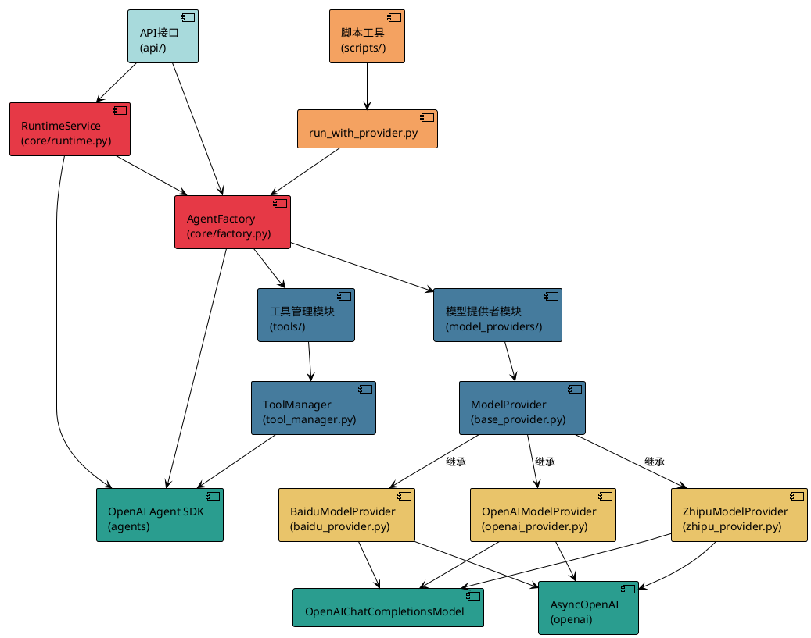

```plantuml
@startuml

!theme plain
skinparam BackgroundColor white
skinparam componentStyle uml2
skinparam nodeSep 70
skinparam rankSep 50

' 核心组件
[AgentFactory\n(core/factory.py)] as Factory #e63946
[RuntimeService\n(core/runtime.py)] as Runtime #e63946
[模型提供者模块\n(model_providers/)] as ModelProviders #457b9d
[工具管理模块\n(tools/)] as Tools #457b9d
[API接口\n(api/)] as ApiEndpoints #a8dadc
[脚本工具\n(scripts/)] as Scripts #f4a261

' 模型提供者
[ModelProvider\n(base_provider.py)] as BaseProvider #457b9d
[ZhipuModelProvider\n(zhipu_provider.py)] as ZhipuProvider #e9c46a
[BaiduModelProvider\n(baidu_provider.py)] as BaiduProvider #e9c46a
[OpenAIModelProvider\n(openai_provider.py)] as OpenAIProvider #e9c46a

' 外部依赖
[OpenAI Agent SDK\n(agents)] as AgentSDK #2a9d8f
[AsyncOpenAI\n(openai)] as AsyncOpenAI #2a9d8f
[OpenAIChatCompletionsModel] as ChatCompModel #2a9d8f

' 工具集
[ToolManager\n(tool_manager.py)] as ToolManager #457b9d

' 工具脚本
[run_with_provider.py] as RunWithProvider #f4a261

' 依赖关系
Factory --> AgentSDK
Factory --> ModelProviders
Factory --> Tools

ModelProviders --> BaseProvider
BaseProvider --> ZhipuProvider: 继承
BaseProvider --> BaiduProvider: 继承
BaseProvider --> OpenAIProvider: 继承

ZhipuProvider --> AsyncOpenAI
ZhipuProvider --> ChatCompModel
BaiduProvider --> AsyncOpenAI
BaiduProvider --> ChatCompModel
OpenAIProvider --> AsyncOpenAI
OpenAIProvider --> ChatCompModel

Tools --> ToolManager
ToolManager --> AgentSDK

Scripts --> RunWithProvider
RunWithProvider --> Factory

Runtime --> Factory
Runtime --> AgentSDK

ApiEndpoints --> Runtime
ApiEndpoints --> Factory

@enduml
```