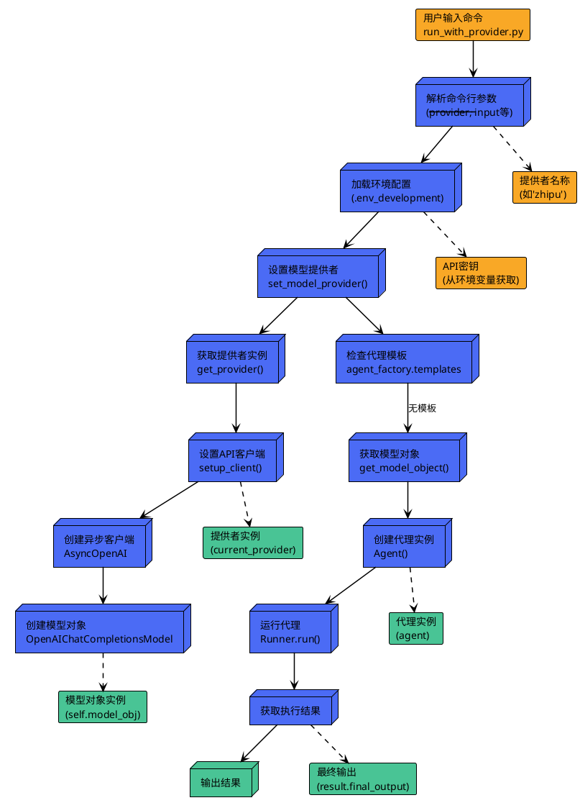

```plantuml
@startuml

!theme plain
skinparam BackgroundColor white
skinparam nodeSep 70
skinparam rankSep 50
skinparam ArrowColor black
skinparam ArrowThickness 1.5

' 用户输入
card "用户输入命令\nrun_with_provider.py" as UserInput #F9A826

' 命令行解析
node "解析命令行参数\n(--provider, --input等)" as ParseArgs #4B6BF5
node "加载环境配置\n(.env_development)" as LoadEnv #4B6BF5

' 设置环节
node "设置模型提供者\nset_model_provider()" as SetProvider #4B6BF5

' 提供者内部流程
node "获取提供者实例\nget_provider()" as GetProviderInstance #4B6BF5
node "设置API客户端\nsetup_client()" as SetupClient #4B6BF5
node "创建异步客户端\nAsyncOpenAI" as CreateClient #4B6BF5
node "创建模型对象\nOpenAIChatCompletionsModel" as CreateModel #4B6BF5

' 代理创建
node "检查代理模板\nagent_factory.templates" as GetAgentTemplate #4B6BF5
node "获取模型对象\nget_model_object()" as GetModelObject #4B6BF5
node "创建代理实例\nAgent()" as CreateAgent #4B6BF5

' 运行
node "运行代理\nRunner.run()" as RunAgent #4B6BF5
node "获取执行结果" as GetResult #4B6BF5
node "输出结果" as PrintResult #49C495

' 关键数据节点
card "提供者名称\n(如'zhipu')" as ProviderName #F9A826
card "API密钥\n(从环境变量获取)" as ApiKey #F9A826
card "模型对象实例\n(self.model_obj)" as ModelObject #49C495
card "提供者实例\n(current_provider)" as ProviderInstance #49C495
card "代理实例\n(agent)" as AgentInstance #49C495
card "最终输出\n(result.final_output)" as FinalOutput #49C495

' 流程连接
UserInput --> ParseArgs
ParseArgs --> LoadEnv
LoadEnv --> SetProvider

SetProvider --> GetProviderInstance
GetProviderInstance --> SetupClient
SetupClient --> CreateClient
CreateClient --> CreateModel

SetProvider --> GetAgentTemplate
GetAgentTemplate --> GetModelObject: 无模板
GetModelObject --> CreateAgent

CreateAgent --> RunAgent
RunAgent --> GetResult
GetResult --> PrintResult

' 关键数据关联
ParseArgs ..> ProviderName
LoadEnv ..> ApiKey
SetupClient ..> ProviderInstance
CreateModel ..> ModelObject
CreateAgent ..> AgentInstance
GetResult ..> FinalOutput

@enduml
```