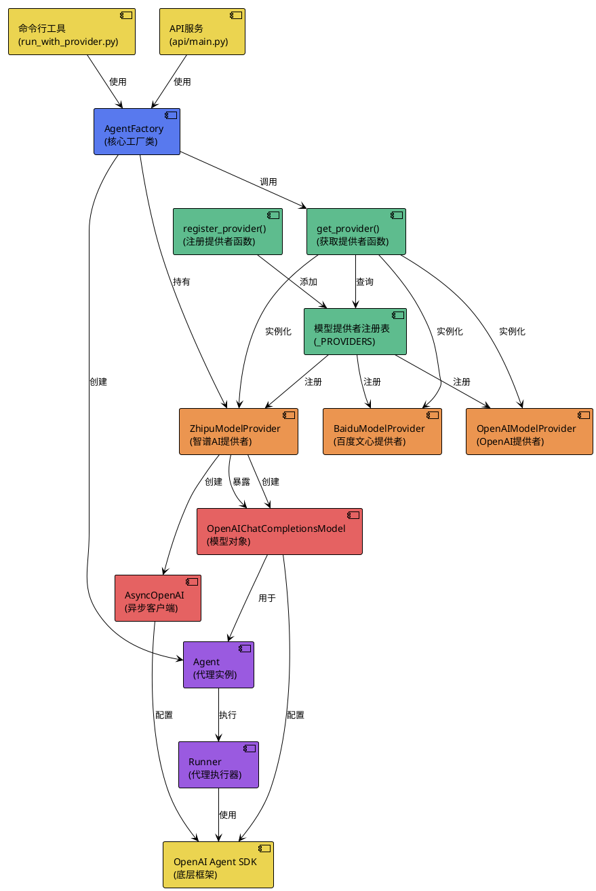

# 系统架构与数据流全景图

```plantuml
@startuml

!theme plain
skinparam BackgroundColor white
skinparam ComponentStyle uml2
skinparam handwritten false

' 组件定义
[AgentFactory\n(核心工厂类)] as Factory #5879EE
[模型提供者注册表\n(_PROVIDERS)] as Registry #5EBC8E
[ZhipuModelProvider\n(智谱AI提供者)] as ZProvider #EB9550
[BaiduModelProvider\n(百度文心提供者)] as BProvider #EB9550
[OpenAIModelProvider\n(OpenAI提供者)] as OProvider #EB9550
[OpenAI Agent SDK\n(底层框架)] as AgentSDK #EBD450
[Runner\n(代理执行器)] as Runner #9A5AE0
[Agent\n(代理实例)] as Agent #9A5AE0
[register_provider()\n(注册提供者函数)] as Register #5EBC8E
[get_provider()\n(获取提供者函数)] as GetProvider #5EBC8E
[AsyncOpenAI\n(异步客户端)] as AsyncClient #E56262
[OpenAIChatCompletionsModel\n(模型对象)] as ModelObj #E56262
[命令行工具\n(run_with_provider.py)] as Cmd #EBD450
[API服务\n(api/main.py)] as ApiService #EBD450

' 连接线
Registry --> ZProvider : 注册
Registry --> BProvider : 注册
Registry --> OProvider : 注册

Register --> Registry : 添加
GetProvider --> Registry : 查询
GetProvider --> ZProvider : 实例化
GetProvider --> BProvider : 实例化
GetProvider --> OProvider : 实例化

Factory --> GetProvider : 调用
Factory --> ZProvider : 持有

ZProvider --> AsyncClient : 创建
ZProvider --> ModelObj : 创建
ZProvider --> ModelObj : 暴露

AsyncClient --> AgentSDK : 配置
ModelObj --> AgentSDK : 配置

Factory --> Agent : 创建
ModelObj --> Agent : 用于

Cmd --> Factory : 使用
ApiService --> Factory : 使用

Agent --> Runner : 执行
Runner --> AgentSDK : 使用

@enduml
```