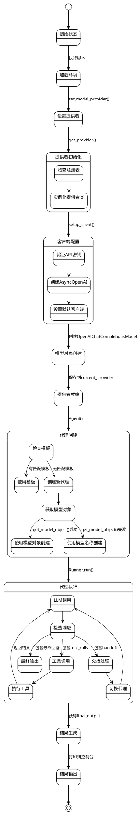

```plantuml
@startuml

!theme plain
skinparam BackgroundColor white
skinparam StateFontSize 14
skinparam StateBackgroundColor white
skinparam StateBorderColor black
skinparam ArrowColor black

state "初始状态" as Init
state "加载环境" as LoadEnv
state "设置提供者" as SetProvider

state "提供者初始化" as ProviderInit {
    state "检查注册表" as CheckRegistry
    state "实例化提供者类" as InstProvider
    
    CheckRegistry --> InstProvider
}

state "客户端配置" as ClientSetup {
    state "验证API密钥" as ValidateKey
    state "创建AsyncOpenAI" as CreateClient
    state "设置默认客户端" as SetDefaultClient
    
    ValidateKey --> CreateClient
    CreateClient --> SetDefaultClient
}

state "模型对象创建" as CreateModel
state "提供者就绪" as ProviderReady

state "代理创建" as AgentCreate {
    state "检查模板" as CheckTemplate
    state "使用模板" as UseTemplate
    state "创建新代理" as CreateNewAgent
    state "获取模型对象" as GetModelObj
    state "使用模型对象创建" as UseModelObj
    state "使用模型名称创建" as UseModelName
    
    CheckTemplate --> UseTemplate: 有匹配模板
    CheckTemplate --> CreateNewAgent: 无匹配模板
    
    CreateNewAgent --> GetModelObj
    GetModelObj --> UseModelObj: get_model_object()成功
    GetModelObj --> UseModelName: get_model_object()失败
}

state "代理执行" as AgentExec {
    state "LLM调用" as LlmCall
    state "检查响应" as CheckResponse
    state "工具调用" as ToolCall
    state "交接处理" as Handoff
    state "最终输出" as FinalOutput
    state "执行工具" as ExecTool
    state "切换代理" as SwitchAgent
    
    LlmCall --> CheckResponse
    CheckResponse --> ToolCall: 包含tool_calls
    CheckResponse --> Handoff: 包含handoff
    CheckResponse --> FinalOutput: 包含最终回答
    
    ToolCall --> ExecTool
    ExecTool --> LlmCall: 返回结果
    
    Handoff --> SwitchAgent
    SwitchAgent --> LlmCall
}

state "结果生成" as ResultGen
state "结果输出" as ResultOutput

[*] --> Init
Init --> LoadEnv: 执行脚本
LoadEnv --> SetProvider: set_model_provider()
SetProvider --> ProviderInit: get_provider()
ProviderInit --> ClientSetup: setup_client()
ClientSetup --> CreateModel: 创建OpenAIChatCompletionsModel
CreateModel --> ProviderReady: 保存到current_provider
ProviderReady --> AgentCreate: Agent()
AgentCreate --> AgentExec: Runner.run()
AgentExec --> ResultGen: 获得final_output
ResultGen --> ResultOutput: 打印到控制台
ResultOutput --> [*]

@enduml
```